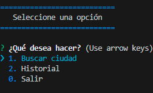

Clima app en Consola
===

Esta app permite la busqueda de ciudades del mundo y retorna el clima que posee. Basados en la ubicación (latitud y longitud) veremos en pantalla la temperatura actual, la minima, máxima, una breve descripción y nombre de la ciudad.
Además se tiene un historial de busqueda que permanece aunque la app se encuentre off. 
___

* Se utilizó:
    1. NodeJs
    2. JavaScript
    3. Axios
    4. Apis: MapBox y Open Weather

